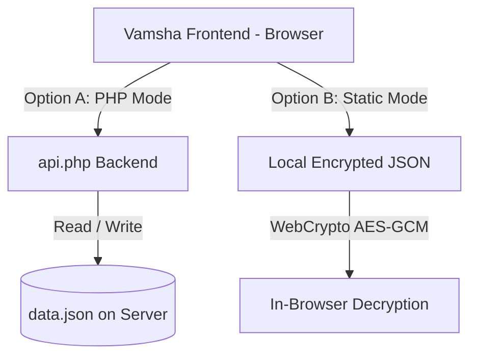
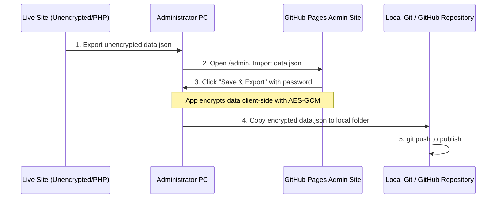

# Vamsha - Unified Family Tree Deployment & Operation Manual

Vamsha (వంశ) is a modern, responsive, and secure multilingual Family Tree application. Built on **React**, **Vite**, and **Tailwind-like Vanilla CSS**, it features a Progressive Web App (PWA) capability, offline editing support, and dual-mode deployment models.

This manual explains how to configure, deploy, distribute, and maintain Vamsha across different hosting environments, including traditional live PHP/Apache servers and static, serverless environments like GitHub Pages.

---

## Table of Contents
1. [Architecture Overview](#1-architecture-overview)
2. [Deployment Method 1: Self-Hosted PHP Server (Live Database)](#2-deployment-method-1-self-hosted-php-server-live-database)
3. [Deployment Method 2: Static Hosting / GitHub Pages (Serverless Encrypted)](#3-deployment-method-2-static-hosting-github-pages-serverless-encrypted)
4. [Runtime Configuration (`config.js`)](#4-runtime-configuration-configjs)
5. [Environment Variables (`.env`)](#5-environment-variables-env)
6. [Local Development & Building](#6-local-development--building)
7. [Administrator Operation Guide](#7-administrator-operation-guide)

---

## 1. Architecture Overview

Vamsha supports two distinct modes of operation depending on your hosting setup:



- **Option A (PHP Backend Mode):** The frontend communicates with a lightweight PHP api endpoint (`api.php`) which reads and writes to a server-side database file (`data.json`). Admin actions update the server file instantly.
- **Option B (Static/Serverless Mode):** The application is hosted purely as static assets (e.g., GitHub Pages). The database is encrypted client-side using **AES-GCM** (via Web Crypto API). The encrypted `data.json` file is loaded by the browser and decrypted locally using the family password.

---

## 2. Deployment Method 1: Self-Hosted PHP Server (Live Database)

Use this method if you have a traditional Linux/Windows server running Apache/Nginx with PHP (version 7.4 or newer). It allows real-time edits directly from the browser's administrator panel.

### Folder Structure (Zero Configuration)
By placing the compiled frontend folder and the database folder side-by-side in your server's web directory, Vamsha works out-of-the-box:

```text
public_html/
├── vamsha/           <-- Compiled Frontend (index.html, assets/, config.js)
└── vamsha_db/        <-- Backend files (api.php, data.json, .htaccess)
```

- **Frontend URL:** `https://yourdomain.com/vamsha`
- **Backend API URL:** `https://yourdomain.com/vamsha_db/api.php`

> [!NOTE]
> In this configuration, the frontend dynamically searches for the API relative to its own folder (`../vamsha_db/api.php`), meaning no manual URL configuration is required.

---

### Securing `data.json` (Recommended for Privacy)
To prevent unauthorized users from guessing the database location and downloading `data.json` directly, you can move the database file to a secure directory outside the public web root:

1. Create a secure folder on your server that is **not accessible from the web** (e.g., `/home/username/secure_vamsha/`).
2. Move `data.json` into this folder.
3. Open or create the `.env` file inside the `vamsha_db` folder (or at the project root) and define the absolute file path:
   ```env
   VAMSHA_DB_PATH=/home/username/secure_vamsha/data.json
   ```
4. `api.php` will now automatically route all read/write actions to this secure folder.

---

### Decoupled Deployment (Frontend and Backend on Different Servers)
If you wish to host the frontend assets (e.g., on Vercel, Netlify) and keep the PHP backend on a separate domain:

1. Open `public/config.js` in a text editor.
2. Edit the `apiUrl` value to point to your PHP API:
   ```javascript
   window.VAMSHA_CONFIG = {
     apiUrl: "https://your-php-server.com/vamsha_db/api.php",
     // ... other settings
   };
   ```
3. Allow the frontend domain in the backend's CORS policy. Edit `.env` on your PHP server:
   ```env
   CORS_ALLOWED_ORIGINS=https://your-frontend-domain.com
   ```

---

## 3. Deployment Method 2: Static Hosting / GitHub Pages (Serverless Encrypted)

This mode allows you to host the tree completely free on GitHub Pages, Cloudflare Pages, or any static provider. Because there is no PHP backend server to handle passwords, security is performed entirely in the browser using encryption.

### Step 1: Configure `config.js` for Static Mode
Set the API URL to point directly to the static JSON file:
```javascript
window.VAMSHA_CONFIG = {
  apiUrl: "./data.json",
  // Specify the SHA-256 hash of your family password to lock the tree
  familyPasswordHash: "e19701cb9c6b6647783e940e66282827218ba85e4e0ec28e29ba4dffa2bc2c01",
  adminPasswordHash: "48c5eb93ea252a2a5ecbda218da3b0bc223f79b108de81e50daae4e877c78525"
};
```
When `apiUrl` points to a `.json` file, the app automatically boots into **Static / Client-side Decryption** mode.

---

### Step 2: Safe Data Update Workflow (Import/Export)
To update the family tree on your static GitHub Pages site without leaking sensitive unencrypted names:



1. **Export Raw Data:** Log in to your live self-hosted admin panel, go to **Settings** and click **Export JSON**. This downloads the raw, unencrypted `data.json` file to your computer.
2. **Import to GitHub Pages Admin Console:** Open your GitHub Pages admin panel (e.g., `https://username.github.io/vamsha/admin`) and unlock it with your admin password. Click **Import JSON** and upload the raw file you downloaded in Step 1.
3. **Lock & Download:** Once imported, click the **Save & Export** button in the top bar. The app will prompt you for the family password, encrypt the data client-side using AES-GCM, and download a highly secure, encrypted `data.json` file.
4. **Deploy via Git:** Copy this newly downloaded encrypted `data.json` file, paste it into your local repository directory, commit, and push it to GitHub.

> [!CAUTION]
> **CRITICAL SECURITY WARNING:**
> Never push your raw, unencrypted `data.json` directly from the PHP server to a public GitHub repository. Doing so will make all your family member records publicly visible to anyone on the internet. Always use the **Save & Export** flow from the UI to encrypt the file before committing.

---

## 4. Runtime Configuration (`config.js`)

The `public/config.js` file is loaded dynamically by `index.html`. It allows server operators and distributors to customize settings on a pre-built static release without needing any compiler tools (like Node.js or Vite).

| Property | Type | Description |
| :--- | :--- | :--- |
| `apiUrl` | `string` | Location of the backend proxy. Empty (`""`) uses the relative path `../vamsha_db/api.php`. Set to `./data.json` for static hosting. |
| `adminContactEmail` | `string` | Administrator email displayed on the password gate when locked. |
| `adminContactPhone` | `string` | Administrator phone number displayed on the password lock gate. |
| `adminPasswordHash` | `string` | SHA-256 hash of the password used to access the administrator panel. |
| `familyPasswordHash` | `string` | SHA-256 hash of the password used to unlock and view the family tree (Static hosting only). |
| `requireFamilyLockOnPhp` | `boolean` | Set to `true` to require the family password to unlock the tree on PHP servers as well. Default is `false`. |

---

## 5. Environment Variables (`.env`)

For build-time configuration, environment variables are loaded from the root `.env` file when compiling the code:

- `VITE_APP_TITLE`: Custom HTML document title for your family tree deployment.
- `VITE_BASE_URL`: Router base path (e.g., `/` or `/vamsha/`).
- `VITE_ADMIN_PASSWORD_HASH`: Default administrator password SHA-256 hash baked into the build.
- `VITE_FAMILY_PASSWORD_HASH`: Default family password SHA-256 hash baked into the build.
- `VITE_REQUIRE_FAMILY_LOCK_ON_PHP`: Set to `true` to force require the family password on PHP servers. Default is `false`.
- `VITE_API_URL`: Custom API endpoint baked into the build.
- `VAMSHA_DB_PATH`: Secure server folder location for `data.json` (read by `api.php`).
- `CORS_ALLOWED_ORIGINS`: Allowed request origins for backend communication.

---

## 6. Local Development & Building

If you wish to modify the source code, translate components, or build new features:

### Prerequisites
Install [Node.js](https://nodejs.org/) (LTS version recommended).

### Commands
1. **Install Dependencies:**
   ```bash
   npm install
   ```
2. **Start Dev Server (HMR enabled):**
   ```bash
   npm run dev
   ```
   Open `http://localhost:5173` in your browser.
3. **Run Linter (Oxlint):**
   ```bash
   npm run lint
   ```
4. **Compile Production Build:**
   ```bash
   npm run build
   ```
   The compiled assets will be written to the `dist/` directory. Upload the contents of `dist/` to your server.

---

## 7. Administrator Operation Guide

### How to Generate SHA-256 Hashes
To change passwords in `config.js` or `.env`, you must supply a SHA-256 hash of the plaintext password. You can generate a hash using the following commands:

#### In Windows PowerShell:
```powershell
[System.Security.Cryptography.SHA256Managed]::Create().ComputeHash([System.Text.Encoding]::UTF8.GetBytes("yourpassword")) | ForEach-Object { "{0:x2}" -f $_ } | Write-Host -NoNewline
```

#### In Linux/macOS Terminal:
```bash
echo -n "yourpassword" | sha256sum
```

#### In the Browser Console (F12):
```javascript
async function hash(pw) {
  const buf = await crypto.subtle.digest("SHA-256", new TextEncoder().encode(pw));
  console.log(Array.from(new Uint8Array(buf)).map(b => b.toString(16).padStart(2, '0')).join(''));
}
hash("yourpassword");
```

---

### Resolving Sync Conflicts
Vamsha utilizes browser `localStorage` as a fallback drafting space. If you make edits but close the browser without saving, or if another admin saves changes to the server, you may see a conflict banner:

> ⚠️ **Local Browser Changes Mismatch**
> - **Keep Local (లోకల్ డేటా ఉంచు):** Retains edits made in your browser session, allowing you to merge or overwrite the server database on the next save.
> - **Overwrite (సర్వర్ డేటా లోడ్ చేయి):** Discards your unsaved browser edits and pulls the latest approved data from the server.
